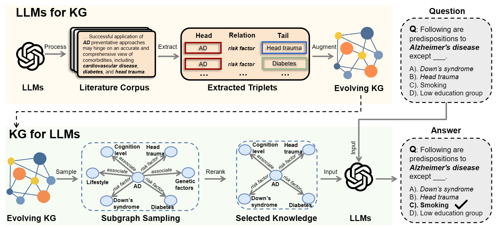

<div align="center">

# DALK: Dynamic Co-Augmentation of LLMs and KG to answer Alzheimer’s Disease Questions with Scientific Literature

</div>

## Update

10.17: DALK has been accepted by EMNLP 2024 Findings! Check our camera-ready version [here](https://arxiv.org/pdf/2405.04819).

## Overview

<p align="center">
  
</p>

## Dependency

To fully run this project, one is recommended to install the requirement packages listed in ``requirements.txt``.

## LLMs for KG

To extract AD-KG for the following steps, one need to first replace the following parts in ``LLM4KG/api_utils.py``:

```
palm.configure(api_key='')
api_key = ''
```

Then run ``LLM4KG/llm2kg_s2s.py`` or ``LLM4KG/llm2kg.py`` to extract AD-KG in generative method or RE method.

We also provide the AD-KG data directly in ``KG4LLM/Alzheimers/train_s2s.txt`` and ``KG4LLM/Alzheimers/train.txt``

## KG for LLMs

### ADQA Benchmark

We put the samples of ADQA benchmark in ``KG4LLM/Alzheimers/result_filter/`` for the original data and ``KG4LLM/Alzheimers/result_ner`` for the data with extracted entities.

### Augment LLMs with AD-KG

To augment LLMs' inference with AD-KG, one need to first create a Blank Sandbox on [Neo4j](https://sandbox.neo4j.com/), and replace the follow parts in ``KG4LLM/MindMap_revised.py``

```
YOUR_OPENAI_KEY = ''
uri = ""
username = ""
password = ""
```

And then, run

```
cd KG4LLM
python MindMap.py
```

It may take a while to upload the local AD-KG data to neo4j.

Credits: This work began as a fork of MindMap' repository: [MindMap](https://github.com/wyl-willing/MindMap). If you found our code useful, please consider citing:

```
@article{li2024dalk,
  title={DALK: Dynamic Co-Augmentation of LLMs and KG to answer Alzheimer's Disease Questions with Scientific Literature},
  author={Li, Dawei and Yang, Shu and Tan, Zhen and Baik, Jae Young and Yun, Sunkwon and Lee, Joseph and Chacko, Aaron and Hou, Bojian and Duong-Tran, Duy and Ding, Ying and others},
  journal={arXiv preprint arXiv:2405.04819},
  year={2024}
}
}
```
